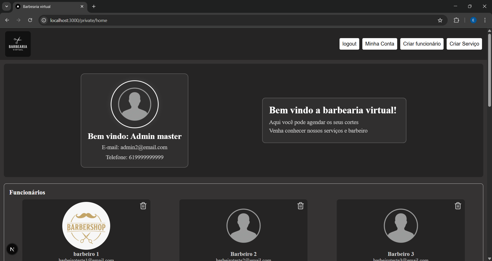
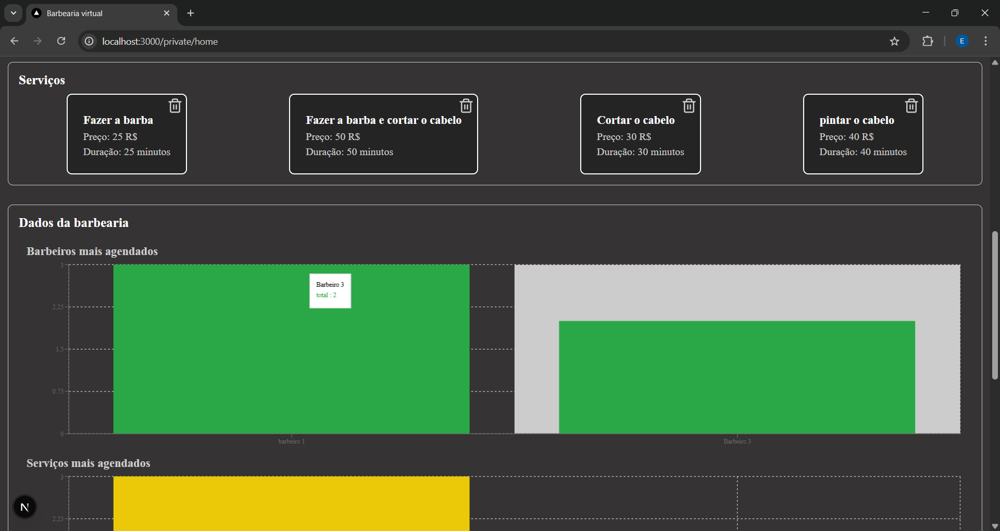
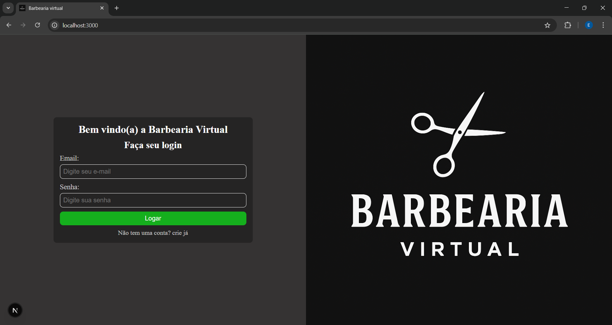
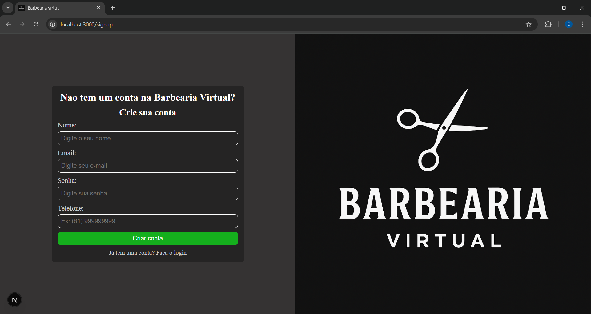
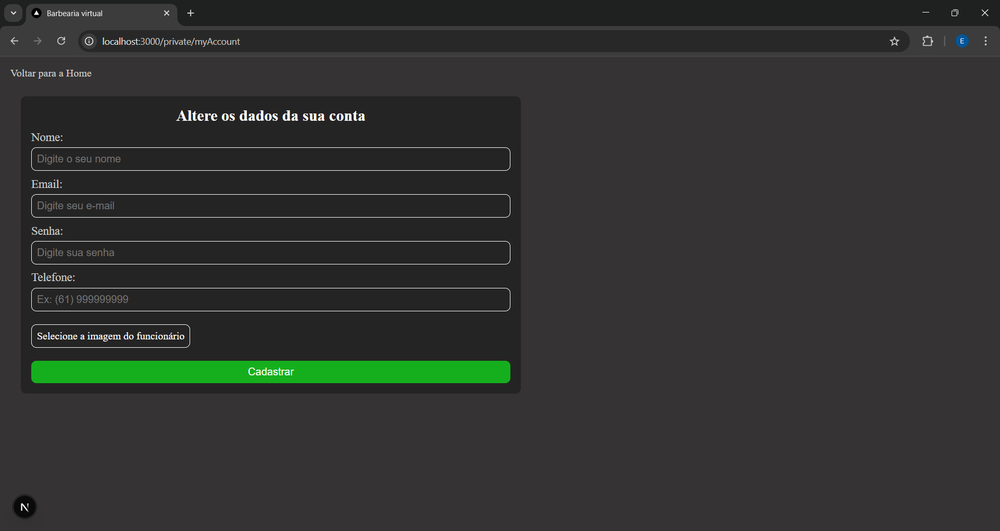
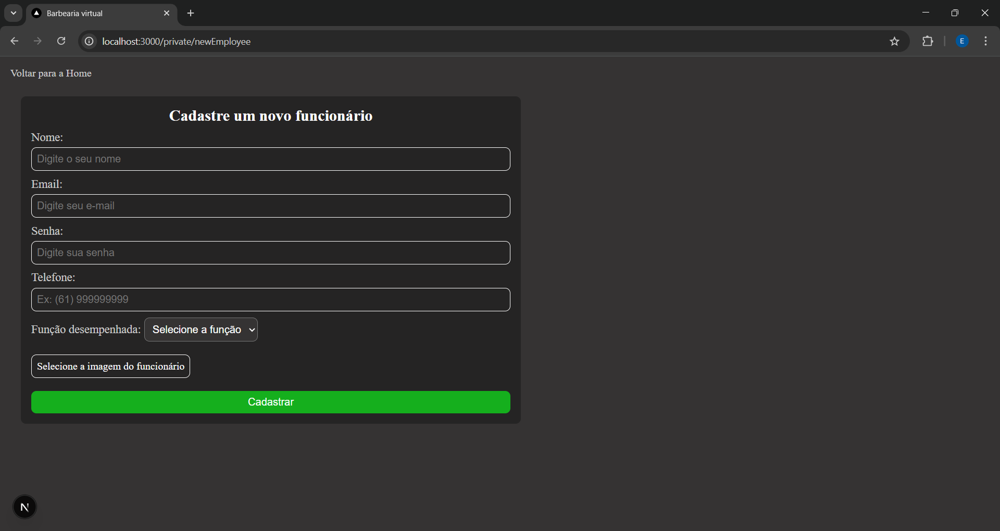
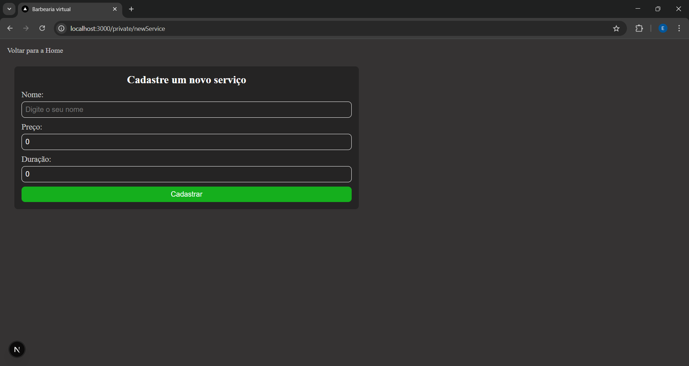
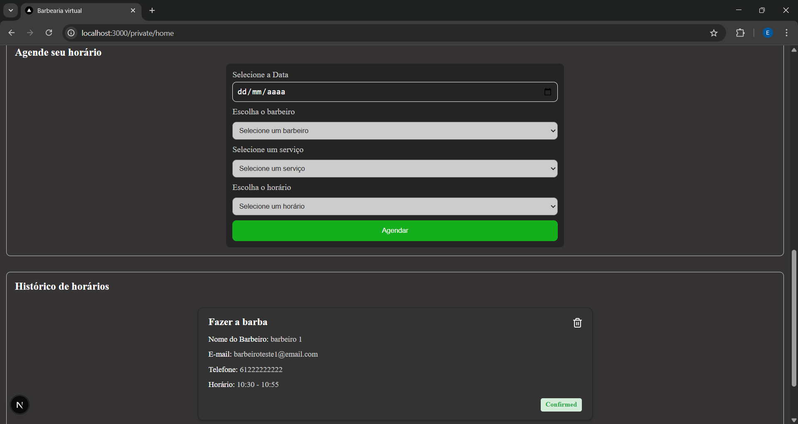

# 💈 Barbearia Virtual

A **Barbearia Virtual** é uma aplicação moderna desenvolvida com **Next.js**, **TypeScript** e **Styled-Components**, oferecendo uma experiência completa para gerenciamento de agendamentos, visualização de barbeiros, serviços e muito mais. O sistema consome uma **API própria** desenvolvida em Node.js.

---

## 🚀 Tecnologias Utilizadas

- **Next.js**
- **TypeScript**
- **Styled-components**
- **Recharts**
- **Axios**
- **JWT Autenticação**

---

## 📸 Demonstração do Projeto

### 🏠 Página Inicial


### 🏠 Página Inicial (2)


### 🔐 Tela de Login


### 🧾 Cadastro


### 👤 Minha Conta


### ✂️ Novo Funcionário


### 💈 Novo Serviço


### 📅 Agendamento (Cliente)


### 📅 Agendamento (Barbeiro)


---

## ⚙️ Funcionalidades

- ✔️ Autenticação com JWT  
- ✔️ Listagem de barbeiros  
- ✔️ Agendamento de serviços  
- ✔️ Dashboard com estatísticas  
- ✔️ Filtragem por "role" 
- ✔️ Cancelamento e remoção de agendamentos
- ✔️ Upload de avatar
- ✔️ Responsividade completa  
- ✔️ Consumo da API própria  
- ✔️ Controle de permissões por usuário  
---

## 📁 Estrutura do Projeto

```
.
├── public/
│   └── images/        # Imagens usadas no projeto
│
├── src/
│   ├── app/           # Rotas e páginas do Next.js
│   ├── components/    # Componentes reutilizáveis
│   ├── context/       # Context API (Auth, Agendamentos, etc.)
│   ├── hooks/         # Hooks personalizados
│   ├── services/      # Configurações de API (Axios)
│   ├── styles/        # Estilos globais e temas
│   └── types/         # Tipagens TypeScript
│
└── README.md
```

## 🖥️ Como rodar a aplicação

### 1️⃣ Clone o repositório e instale as dependências

```bash
git clone https://github.com/EduardoAugustoFReis/Barbearia-virtual.git
cd Barbearia-virtual
npm install
# ou
yarn


2️⃣ Configure o ambiente

Crie o arquivo .env.local na raiz do projeto:

NEXT_PUBLIC_API_URL=http://localhost:3333

3️⃣ Execute o projeto
npm run dev
# ou
yarn dev
```
## 📚 API Consumida

A aplicação consome a API própria:

🔗 **[Repositório da API](https://github.com/EduardoAugustoFReis/api-barbearia)**

Principais endpoints:
```
POST /login
POST /users
GET  /users
GET  /users/barbers
GET  /services
POST /appointments
GET  /appointments
DELETE /appointments/:id
````

## 📊 Dashboard

O dashboard exibe:

- Barbeiros mais agendados
- Serviços mais realizados
- Totais do dia/semana
- Gráficos criados com Recharts

## 🧑‍💻 Autor

Desenvolvido por **Eduardo Augusto Franciscon Reis**

💼 **LinkedIn:**  
[www.linkedin.com/in/eduardo-augusto-franciscon-reis-173410283](https://www.linkedin.com/in/eduardo-augusto-franciscon-reis-173410283/)
